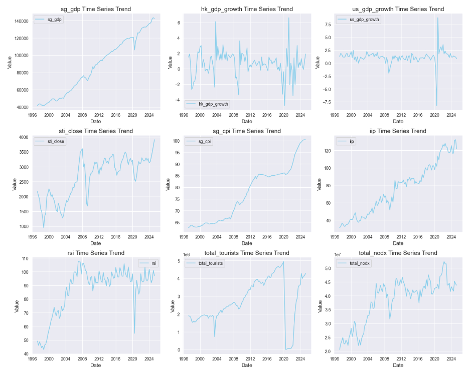

# Singapore Quarterly GDP Forecasting Model & API

## 📊 Project Overview

This application forecasts Singapore's **quarterly GDP growth** from 2025 to 2030 using macroeconomic indicators as features. 3 different models **[Linear Regression, SARIMAX, Prophet]** were developed and evaluated towards identifying the best fit model for deployment. The pipeline is exposed via a **FastAPI** REST endpoint and deployed using **Docker** and **Google Cloud Platform**.

### Feature Variables
```
* US Gross Domestic Product Quarterly Growth Rate
* Hong Kong Gross Domestic Product Quarterly Growth Rate
* Retail Sales Index
* Consumer Price Index
* Non-Oil Domestic Exports (NODX)
* Straits Times Index (STI) Exchange
* International Tourist Entry Statistics
* Index of Industrial Production 
```

*Data of macroeconomic indicators of Singapore was sourced from Singapore's Department of Statistics. The quarterly growth rate of GDP of US and Hong Kong were acquired from the Federal Reserve of Economic Data (FRED) and Hong Kong's Census & Statistics Department respectively. The monthly closing value of Straits Time Index was sourced from "yfinance" library*

## Problem Statement/ Objective

To develop a scalable, data-driven forecasting API that predicts Singapore’s quarterly GDP growth using macroeconomic indicators and machine learning models, enabling strategic economic insights from 2025 to 2030. 


## 🌐 Technologies Used

- Python
- StatsModel
- Scikit-Learn
- Meta's Prophet
- FastAPI
- Docker (Containerization)
- Google Cloud Platform (Cloud Deployment)


## 🔍 Data Exploration

### Time-Series Line Analysis



### Outlier Detection

* No outliers were detected in the GDP value


### Seasonal Distribution of Singapore's GDP


### Seasonal Decomposition of Singapore's GDP


### Stationarity Testing with Augmented Dickey-Fuller (ADF) test

* NULL HYPOTHESIS: The time-series data is not stationary.
* CONCLUSION: P-Value higher than 0.05. Reject null hypothesis. Differencing must be applied


### Autocorrelation Function (ACF) & Partial Autocorrelation Function (PACF) Graphs

* Used to acquire parameters for time-series modelling, specifically SARIMAX.

**Before Differencing:**


* Seasonal component observed
* Target variable needs seasonal differencing also.

**After Seasonal Differencing:**


EXTRACTED VALUES:

***PACF Plot :***
* p (Auto-Regressive) = 0 -> NONE
* P (Seasonal AR) = 3 -> Large spikes as seasonal lags 4, 8, 12.

***ACF Plot :***
* q (Moving Average) = 0 -> Large spikes at non-seasonal lags -> NONE
* Q (Seasonal MA) = 1 -> Large spikes at seasonal lags (Lag 4,8,12,16) -> Only found at lag 4

* d (Non-Seasonal Differencing) = 1 
* D (Seasonal Differencing) = 1
* s (Seasonality) = 4 -> Q1 to Q4 of a year

### Feature Correlation

* CPI and RSI have insignificant correlation patterns with the target variable.


### Granger's Causality Test

* NODX and RSI have little to no contribution to the growth trend of Singapore's GDP.


---

## ⚙️ Data Pre-processing & Feature Engineering

### Data Loading

* All the datasets were loaded into their respective Pandas data frames.
* Some monthly data like Straits Times Index were aggregated to quarterly data.

### Data Merging

* The data frames were merged using OUTER join with the DateTime index as reference.
* Rows with missing values were present due to difference in data availability for specific time frames.
* Removed such rows and shrinked the time frame of dataset from {Q2 1947 to Q2 2025} to {Q1 1997 to Q1 2025}

<br>

**BEFORE PRUNING: 313 rows**


**AFTER PRUNING: 114 rows**


### Feature Engineering

Key engineered features include:

- **Lag Features** (e.g., `us_gdp_growth_lag3`, `sg_gdp_lag4`)
- **Rolling window aggregates** (e.g., `iip_rollmean4`, `rsi_rollstd2`)
- **Quarter-over-quarter growth metrics** (e.g., `sti_close_qoq_pct`)
- **Time-based features** (e.g., Year/Quarter)

<br>

### Non-Seasonal & Seasonal Differencing

* A function was created to automate the differencing process for both target and feature variables if needed.
* Done by conducting ADF tests after differencing and observing p-value.


## 📊 Model Training & Evaluation

A total of 3 models were developed and evaluated. Different types of pre-processing methods were utilized for different types of model to acquire the best result from each model.

### Linear Regression
---
Machine Learning model which fits linear equation to model relationship between target and feature variables

**TECHNIQUES:**
* Feature Engineering
* Feature Normalization
* Feature Selection with LassoCV 
* Dimensionality Reduction with Principal Component Analysis (PCA)

**RESULTS:**


### SARIMAX Model (Seasonal Autoregressive Integrated Moving Average with eXogenous regressors)

Time-series forecasting technique which extends ARIMA model with seasonality component and feature/exog variables

**TECHNIQUES:**
* Feature Differencing (Seasonal & Non-Seasonal)
* Manual Feature Selection (from Correlation & Causality Tests)
* Manual Grid Search of SARIMAX Parameters

**RESULTS:**


### Prophet Model (by Meta)

Open-source time series additive model which accounts for seasonality and holiday effects using Fourier series

**TECHNIQUES:**
* Feature Engineering
* Feature Normalization
* Feature Selection with LassoCV 

**RESULTS:**


### Model Evaluation

All three models are evaluated using a similar set of metrices to truly compare and assess their performance.

EVALUATION METRICES:

* ***Root Mean Squared Error (RMSE)***
* ***Mean Absolute Error (MAE)***
* ***Mean Absolute Percentile Error (MAPE)***
* ***R-Squared*** => Variance in GDP that can be predicted from feature variables 
* ***Adjusted R-Squared*** => Penalizes addition of unnecessary variables. Important for models using engineered features
* ***Theil's U2*** => Comparison to Naive model

RESULTS:


**CONCLUSION:**  Prophet model showcases a better performance compared to the other models.


## ⚙️ Exogenous Variable Extrapolation

Instead of real-time user input, **future values** of exogenous variables were **automatically extrapolated** using Linear Regression based on past trends. This is due to the vast range of engineered features used as feature variables for the model. This can complicate user experience who would need to input all values of features. These were stored in a `FutureValues.csv` file.


## 🛠️ API Architecture

🚀 Singapore GDP Forecasting API Endpoint: https://sg-gdp-api-251882328088.asia-southeast1.run.app/predict?year=2027 

*Change the value of year to the year you'd like to forecast*

### Endpoint

```http
GET /predict?year=YYYY
```

### Example Response

```json
{
  "year": 2026,
  "model": "Prophet GDP Forecaster",
  "GDP Value": [
    {"quarter": "Q1", "gdp_prediction": 1.42, "upper_boundary": 1.89, "lower_boundary": 0.94},
    {"quarter": "Q2", "gdp_prediction": 1.53, "upper_boundary": 1.97, "lower_boundary": 1.11},
    ...
  ]
}
```

---

## 🌍 Deployment on GCP

1. **Build Docker Image**

```bash
docker build -t gdp-api .
```

2. **Push to GCP Artifact Registry**

```bash
gcloud auth configure-docker
# Tag and push image here
```

3. **Deploy to Cloud Run**

```bash
gcloud run deploy gdp-api \
  --image gcr.io/YOUR_PROJECT_ID/gdp-api \
  --platform managed \
  --region YOUR_REGION \
  --allow-unauthenticated
```

4. **Access the API** Visit the given endpoint. Use `/docs` for the Swagger UI.

## 📈 Future Enhancements

- Integrate a dashboard to monitor model performance.
- Add optional user input for quarterly features and extrapolate based on them.
- Integrate model with live APIs to pull values for exogenous features.
